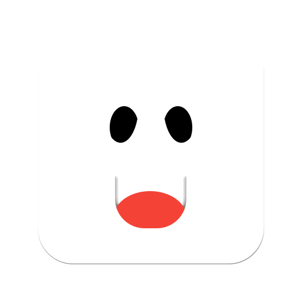

</img>
JimBoy
=============

### A GameBoy Emulator
A project that I'm working on in my spare time as a hobby project.
The Emulator is written in C++ and uses SDL2, using the [Pan Docs](https://gbdev.io/pandocs/) for reference.

## Dependencies
  - [SDL2](https://www.libsdl.org/)
  - [imgui](https://github.com/ocornut/imgui)
  - [imgui_sdl](https://github.com/Tyyppi77/imgui_sdl)
  - [imgui_club](https://github.com/ocornut/imgui_club)
